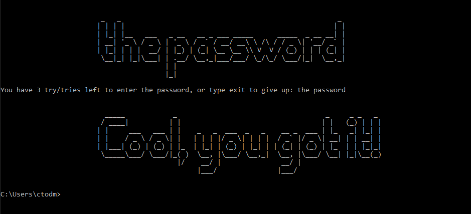

**Christian Todhunter**

**06/02/2020**

**IT FDN 100 A**

**Assignment07**

# Errors Handling Pickles???

## Introduction to Module 07
For Module 07 we learned about pickling and error handling. We learned how pickling is pretty nifty for serializing (pickling) de-serializing (unpickling) and adding persistence to a program. In addition to this, we reviewed error handling, how to catch certain errors, how to create custom error handling, and how to print out custom messages when catching an exception. Last but not least, we have begun dabbling with the Markdown language with a ‘Github Flavor’ to take the words from this document (or maybe you are on the site already) and posting them to a Github webpage. 

### The Assignment Requirements
For this assignment, we set out to learn about pickles from the web, from the assigned reading, the class videos, and/or other texts. I stuck with the course text and the class videos, but I did end up looking at some youtube videos for assistance. The mission for the scripted assignment is to come up with our own demo code to show a little bit about pickling and error handling in Python. In the process of doing this, I ended up combining the two topics because frankly, my program required it. 

## The Persistent Pickle
I spent quite a bit of time trying to decide what to do. I ended up focusing on the persistence capabilities one is granted when pickling things, so I decided to create a mini-game type script, where a user has 10 tries to guess the password. If the user can’t get it right and they exit, pickling allows my program to ‘remember’ by dumping the current value of a variable to a .dat file via the pickling.dump() method, as shown below:

#### Figure 1: Pickle Dump Example

In Figure 1 (above), a file object is created via the open(file_name, ‘wb+’) line of code. Then pickle.dump() drops or ‘dumps’ the current value of T_minus (my attempt counter) into the object file. After that, the file is closed, and the number of attempts at guessing the password ‘T_minus’ is picked! 
That is basically the best use case for pickling, you can get trickier and expand on it if you want, via pickling lists and then serializing them, but I wanted to keep things simple. I wanted to store one number, T_minus, and read it where it left off the next time I opened the program. How exactly do I read it from the file next time I load the program you may ask? Well, it’s basically the same thing (with some of that error handling we will come back to later). Instead of pickle.dump(file, object) you simple use the pickle.load(file, object) command, and Python will read the binary file (oh yeah you can write binary or normal text files) and bing bang boom, we habe persistence. 
To be fair, I make this sound simple but it is a little complicated for the beginner, it was for me, I ended up a day late because of it! Don’t worry if you have issues, re-read the course text Python Programming for the Absolute Beginner, by Michael Dawson. It got me where I needed to go eventually, I just read to enthusiastically the first time through. 

## Catching the Slippery Pickle Errors... . Or any Errors for that Matter

So, about that error handling I was talking about a little earlier. Turns out it was handy. REALLY handy. I can’t see a way my program would have worked without it. What was my problem? Well, I wanted the program to remember where the user or maybe even a hacker left off after trying to guess a few times. To open the file and read it there are two possibilities. Either the file exists, pickle loads the data and everything works out hunky dory. Well, what if this is the first time opening the program? Well error handling is what! That’s right, with error handling, I was able to catch the error that pops up when the code tries to open a file that isn’t there without overwriting it and creating a new one. Specifically, I caught the FileNotFoundError, and then, recognizing that a file doesn’t exits yet, switch the read mode while opening the file to write mode. See Figure to for the code that executes the error handling upon file opening:

#### Figure 2: FileNotFoundError, creating a file instead!

This part of the code was key to the rest working properly. Once the file is open, the script either creates a new data file with the full amount of guesses left, or it reads how many guesses were left the last time a user exited the program, defeating their efforts to beat the system and get 10 more tries. Pretty cool!
Another example of error handling is forcing an exception to serve as a switch of sorts out of an if-else statement. Yes…. There are easier ways of doing it, but with the ambition of a mad scientist I decided to see if I could and well, you can. It’s actually pretty straight forward. There are certain built in exceptions, one of them being the ZeroDivisionError. I simply coded in a divide by zero event, and then through the user into the tier of code where they need to keep guessing. See Figure 3 below for the script:

#### Figure 3: Forced Error Exceptoin

I honestly can’t think of a reason you would do this other than it’s neat, because an if-else stamen could accomplish the same thing pretty much. But alas, there it is, you can do it if you want to. Maybe it will be an ‘ace in the sleeve’ someday. 

## Erasing all the Data if They Run out of Tries

I did this just for giggles at the end. If the user runs out of guesses, the code prints out a message saying the hard disc will be erased, pauses for a few seconds as if it’s actually doing something, and then displays a goodbye message and puts the user inside an infinite while loops that prints out binary on the same line over and over. The output becomes this very quickly, see Figure 4:

#### Figure 4: Infinity While-Loop for fun

## Testing the Files

Finally, I tested the files in both PyCharm and Command-Line to make sure they ran properly. Figure 5 shows a test run in PyCharm below:

#### Figure 5: Test-run in PyCharm

Below is the same program running at a different phase in command line. The fun part is that I was testing the persistence I set out to accomplish and was able to verify that the countdown for number of guesses left was persistent between the command line and PyCharm runs. Pretty neat! See Figure 6 below:

#### Figure 6: Test-run via CMD

## Conclusion

This was a fun exercise. I enjoyed the freedom of the open-ended assignment, but also learned to value the structure from previous assignment. I will say, I definitely felt like I was learning more organically while paving my own way. I really liked being able to keep track of where the user left of with persistence through pickling, and error handling really came in handy when opening the file for the first time, or routing the script accordingly if the user was re-opening for the second time. Of course, a work-around is to delete the .dat file before re-opening, but this is cool enough for me at the level I am at. 

I almost forgot! Here is a link for the tool I used for that cool ASCII Art:

[ASCII Art Generator](https://www.ascii-art-generator.org/)
